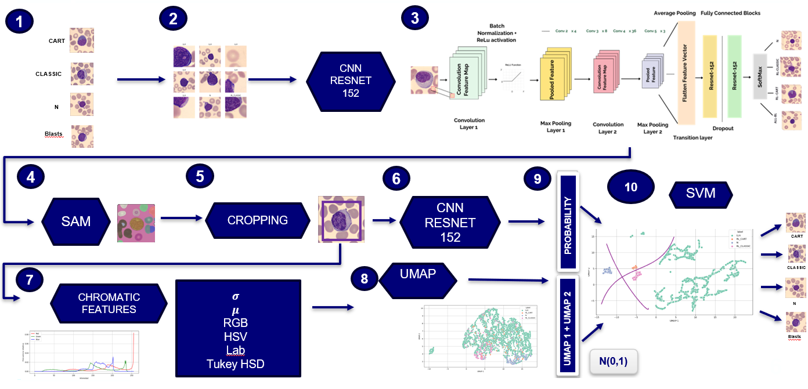
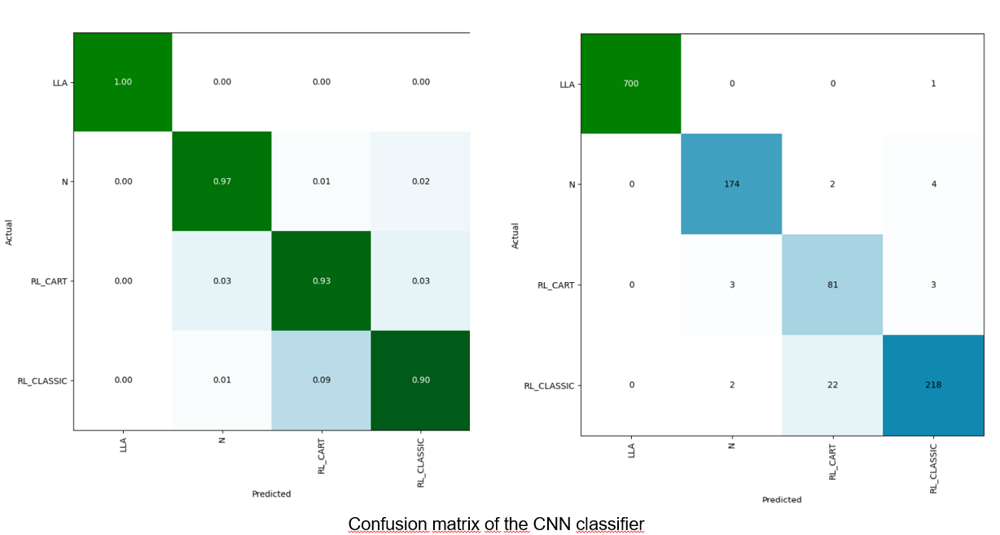
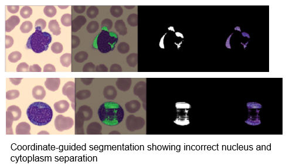
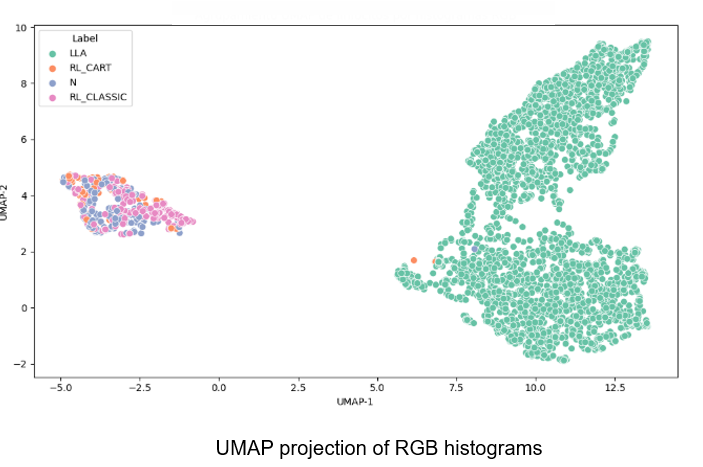
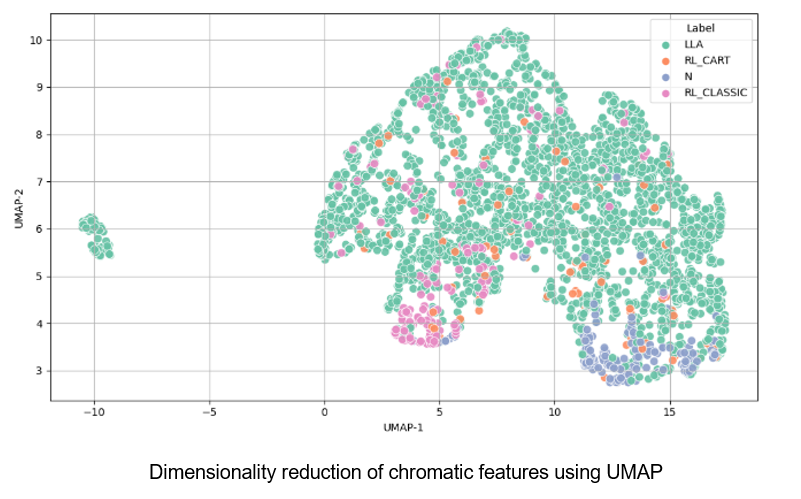
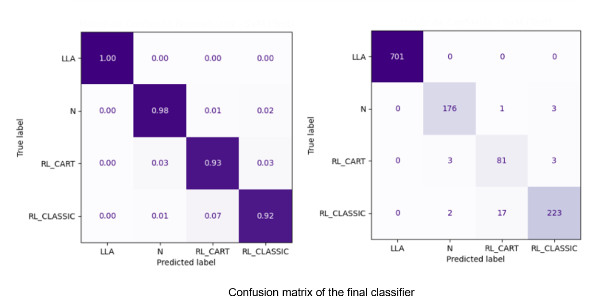

# Automatic Classification of CAR-T Reactive Lymphocytes from Blood Smear Images

Master’s Thesis – Master’s Degree in Bioinformatics and Biostatistics
Inter-university program:  Universitat Oberta de Catalunya (UOC) & Universitat de Barcelona (UB) 

This project presents an end-to-end deep learning pipeline for the automatic classification of lymphocyte subtypes from peripheral blood smear images, with a special focus on CAR-T reactive lymphocytes, 
a challenging and clinically relevant cell population emerging during CAR-T therapy.

## Problem

During CAR-T therapy, reactive CAR-T lymphocytes appear in peripheral blood. These cells:

- Exhibit high morphological variability

- Strongly resemble normal and reactive lymphocytes

- Are difficult to distinguish even for trained specialists

Accurate identification of these cells is important for therapy monitoring and outcome assessment, but manual annotation is time-consuming and subjective.

This thesis addresses this challenge through automated image analysis and deep learning.

## Pipeline

The work combines convolutional neural networks (CNN), image segmentation, chromatic feature engineering, and hybrid machine learning models to improve classification performance in morphologically similar cell types.

## Dataset

- Images: Peripheral blood smear images acquired using CellaVision® systems

- Patients: 57 CAR-T patients + 33 non-CAR-T controls

### Classes:

- CAR-T reactive lymphocytes (RL_CART)

- Reactive classical lymphocytes (RL_CLASSIC)

- Normal lymphocytes (N)

- Acute lymphoblastic leukemia blasts (LLA)

## Data preprocessing:
- Image normalization (ImageNet standards)
  
- Background noise reduction with Cell-level cropping
images cropped by 20% of the original frame

## Deep Learning Image Classification

Architecture: ResNet-152

Task: Multiclass classification of lymphocyte types

### Training strategy:

- Transfer learning

- Fine-tuning with low learning rate

- Early stopping and validation monitoring

### Key outcome:

Strong performance despite high inter-class similarity
The CNN achieved a global Matthews Correlation Coefficient (MCC) of 0.9493. 
The model performed exceptionally well on blast and normal lymphocytes, while CAR-T cells, being morphologically similar to reactive lymphocytes, represented the most challenging class.

Despite this, the model reached a high CAR-T recall of 0.93, showing its ability to reliably detect clinically relevant CAR-T cells, with most errors driven by overlap with reactive classical lymphocytes.

## Image Segmentation

- Model tested: Segment Anything Model (SAM)

- Goal: Nucleus and cytoplasm segmentation

### Finding:

- SAM performed poorly on small, low-contrast cellular structures

## Chromatic Feature Extraction

Extraction of color descriptors from color spaces:

- RGB

- HSV

- LAB 

## Dimensionality Reduction & Visualization

UMAP applied to chromatic features

### Analysis revealed:

- Strong chromatic differences for blasts and other lymphocytes

- Significant overlap for CAR-T and reactive lymphocytes

## Hybrid Model (Late Fusion)

Inputs combined:

- CNN output probabilities

- UMAP-reduced chromatic descriptors
  
- Improve interpretability of learned patterns

- Classifier: Support Vector Machine (SVM) with an RBF kernel.

## Results

- Improved clustering

- Better performance in under-represented and overlapping classes

### Final model performance:

- Overall accuracy: 96%

- CAR-T recall: 93%

- Matthews Correlation Coefficient (MCC): 0.96

The final UMAP shows more compact and well-separated clusters,
demonstrating that combining CNN outputs with chromatic features improves class grouping 
and enhances classification of overlapping or underrepresented cell types.

The hybrid CNN + chromatic feature approach outperformed the CNN alone

Demonstrated the value of combining deep representations with engineered features

-------------------------
# Confidenciality

This project was developed as part of my Master’s Thesis under the academic supervision of Kevin Ivan Barrera Llanga, PhD. 
Computational resources and scientific support were provided by the CoDAlab and CellsiLab research groups at the Universitat Politècnica de Catalunya. 
Clinical data were made available by the Hematology and Cytology Unit of the CORE Laboratory at Hospital Clínic de Barcelona. 
All datasets, raw images, and any sensitive or proprietary information belong to the aforementioned institutions and are not publicly shared. 
This repository presents a technical summary of the methodology and the main results obtained, without disclosing confidential data or institutional assets.
